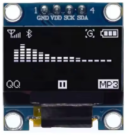

# <u>**OLED display**</u>

0.96" OLED display, with SSD1315 or SSD1306 controller.  

Pinout:
* GND
* VCC/VDD: 3.3-5V (check your module data sheet !)
* SCL: I2C clock line
* SDA: I2C data line

**Sourcing**  
These modules are very common and can be found from different producers.
Some source examples:    
* [Aliexpress](https://www.aliexpress.com/i/3256805299682639.html)  
* [LCSC](https://www.lcsc.com/product-detail/C5248080.html)
* [Amazon USA](https://www.amazon.com/Display-SSD1315-Raspberry-WisBlock-Meshtastic/dp/B0DTPFRG8N)
* [Google] : search "arduino oled SSD1306".