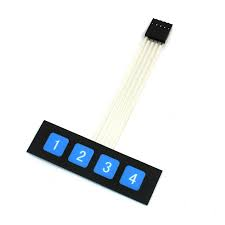

# <u>**Membrane keypad 1x4**</u>

Membrane keypad with 4 keys (1 row x 4 columns).
When a key is pressed the key_n signal is connected to GND.

Pinout:
* GND
* Key 1...4 : key pressed signals

**Sourcing**  
Super easy to be found online.
  
* [Google] : search "membrane keypad 1x4".