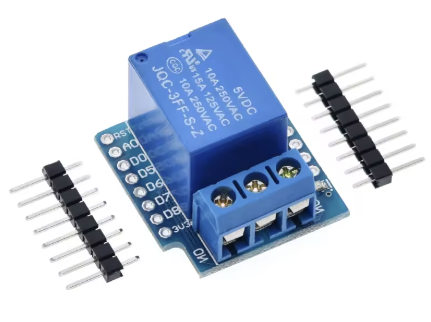

# <u>**Relay**</u>  

"D1 mini" relay module from Wemos.  
This Relay module can be activated by 3.3v signal directly from the micro.

Note that only 3 pin are used:
* G : GND
* 5V 
* D1 : ON/OFF 3.3v signal

**Sourcing**  
"D1 mini" module is avaible from the original producer or a lot of clone version. 
Any relay module that can be managed directly with a 3.3v from the micro can fit for the purpose.

* [Google] : search "D1 mini relay module".
